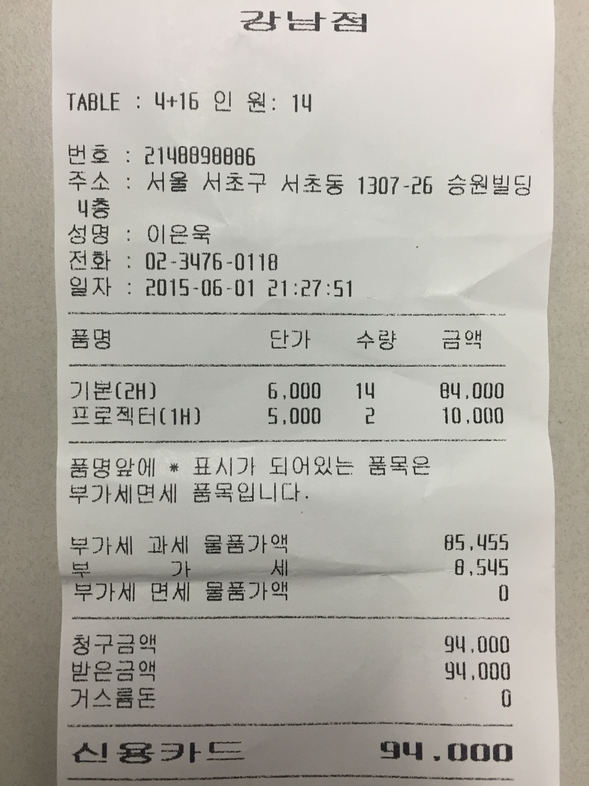

### 손고리즘2 알고리즘 기초 스터디 2회차 - 영수증
*(단위: 원)*
#### 2015.06.01 토즈 강남점
   이름  |   회비   |   사용액  |   잔액   |
------- | ------- | --------- | ------- |
이동환 | 8,500 | 6,720 | 1,780
김용성 | 8,500 | 6,720 | 1,780
황초예 | 8,500 | 6,720 | 1,780
김시현 | 8,500 | 6,720 | 1,780
정재윤 | 8,500 | 6,720 | 1,780
임상배 | 8,500 | 6,720 | 1,780
임동권 | 8,500 | 6,720 | 1,780
최일지 | 8,500 | 6,720 | 1,780
이동원 | 8,500 | 6,720 | 1,780
박진수 | 8,500 | 6,720 | 1,780
조은우 | 6,720 | 6,720 | 0
방진호 | | |
김명근 | | |
임성광 | | |

